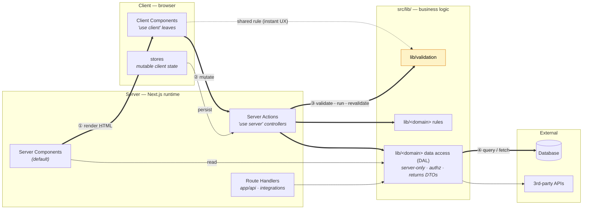

# Architecture rules

Sort code by **what it is**, not where it's first used. A layer may import from
layers above it in this table, never below.

## Target architecture

Runtime data flow, following one request (numbers trace the lifecycle). This
shows *how the layers talk across the network boundary*; the static composition
of each layer (which primitive imports which) is the table below.



The thick arrows are the happy path of a mutation: a Server Component renders the
page, a Client Component fires a Server Action, the action runs business logic in
`src/lib/`, and data access reaches the database. `lib/validation` (highlighted)
is the canonical **shared-across-the-boundary** case — the *same* rule runs
client-side for instant feedback (dotted) and server-side in the action for trust;
never duplicate it. `Route Handlers` exist only for integration boundaries (e.g. a
3rd-party webhook posting in); our own UI uses Server Actions.

The `server-only` data-access node is Next.js's recommended **Data Access Layer**:
it is the *only* place that touches the database and `process.env`, it re-checks
**authorization** (ownership, not just "is logged in" — the action verifies auth
too, but resource authz lives here as defense-in-depth), and it returns minimal
**DTOs** rather than raw rows so private fields never reach the client. A Server
Action is a public POST endpoint even when only your UI calls it, so it must
validate input and re-authorize on every call — never trust the page-level guard.

| Layer | Folder | Rule |
|-------|--------|------|
| Pure logic | `src/lib/` | Framework-agnostic. No React/Next imports. Pure functions + constants. Reusable & unit-testable. |
| Reusable behavior | `src/hooks/` | Shared *stateful* React logic. Create only when behavior is reused across ≥2 components. |
| Config / data | `src/config/` | Static app data separated from JSX (e.g. nav items). |
| UI primitives | `src/components/ui/` | Generic, presentational. Prefer **base + variant** composition (e.g. `TextField` → `PasswordField`). |
| Icons | `src/components/icons/` | Brand/custom SVGs that `lucide-react` doesn't ship. Standard icons come from `lucide-react` — never inline an SVG a component could import. |
| Feature components | `src/components/<feature>/` | Compose primitives + hooks + lib for one feature. Hold *orchestration*, not reusable rules. |

## When you spot duplication

Move the shared piece **up** to the layer that matches what it is — a pure rule
goes to `lib/`, shared stateful behavior to `hooks/`, shared markup to a `ui/`
primitive — then have both call sites import it. Don't copy.

## `src/lib/` organization

Group by **type, then domain**: a type-namespace folder holds a `common.ts` for
generic reusable helpers plus one file per domain for feature-specific logic.

```
src/lib/validation/
  common.ts   # generic, reusable: isValidEmail, isRequired
  auth.ts     # domain-specific: validateLogin (composes common.ts)
```

Generic primitives go in `common.ts` so the next feature can find them; keep
domain-specific orchestration (which fields, which messages) in the domain file,
not inline in components.

## Where business logic lives

All business logic — validation, domain rules, calculations, data access — lives
in `src/lib/`, framework-agnostic and callable from **both** sides of the network
boundary. Components, hooks, stores, and Server Actions are **thin callers**,
never the home of a rule.

A rule that must be trusted (pricing, auth, persistence) runs **server-side**; the
same `lib/` function may also run client-side for instant UX — e.g.
`validateLogin` runs in the form *and* re-runs in the Server Action. Share the one
function; never duplicate a rule across the boundary.

## Server / client layers

Default to **Server Components**. Add `'use client'` only on the smallest
interactive leaf — never raise it to a page because a child needs it.

| Layer | Folder / marker | Rule |
|-------|-----------------|------|
| Data access | `src/lib/<domain>/` + `import "server-only"` | DB queries, secrets, 3rd-party fetches. `server-only` so an accidental client import fails at build. Still no React/Next imports. |
| Server Actions | `'use server'` — co-locate `actions.ts` by the feature, or `src/lib/actions/` when shared | Mutation entry point for our own UI. Thin **controller**: validate input (Zod from `lib/validation`), authorize, call `lib/`, revalidate. No business rules inline. |
| Route Handlers | `src/app/api/` | Only for **integration boundaries** (webhooks, public / 3rd-party APIs). For our own UI mutations, prefer a Server Action. |

Rule of thumb: internal UI mutation → **Server Action**; external boundary →
**Route Handler**.

## Stores (client state, not business logic)

A store — if one is ever added — holds **mutable client state** (cart, wizard
step, filter UI). It is *not* where business logic goes. It sits at the
`src/hooks/` level: shared stateful client behavior that **calls into `lib/`** for
rules and into Server Actions for anything persisted or trusted.

- Reach for a store only for genuinely client-only, cross-component, mutable
  state. One component → `useState`. Server data → fetch in a Server Component.
- App Router caveat: create the store **per request in a Provider**, never as a
  module singleton (it leaks state across requests on the server). Don't read
  store data from Server Components.

## Cross-cutting concerns

These don't live in one layer — they cut across the request. Decide the home once,
here, so features don't scatter them:

- **Auth / session** → `src/lib/auth` (`server-only`). Expose a `cache()`-wrapped
  `getCurrentUser()` so Server Components, the DAL, and Server Actions read the
  same session without prop-drilling. Authentication ("is logged in") is checked in
  the Server Action; resource **authorization** ("owns this row") in the DAL.
- **Caching** → opt-in only. Reads are dynamic by default; add `'use cache'` +
  `cacheTag`/`cacheLife` (from `next/cache`) to a `lib/` data function when a result
  is shareable, and `revalidateTag`/`revalidatePath` in the Server Action after a
  write. The old `dynamic`/`revalidate` segment exports are gone.
- **Secrets / env** → only the DAL reads `process.env`. Anything client-exposed
  must be `NEXT_PUBLIC_`-prefixed and is therefore assumed public.
- **Error handling** → Server Actions return a typed result (`{ ok: false, error }`),
  never throw raw DB errors to the client; route-level failures use `error.tsx` /
  `not-found.tsx`.
- **Rate limiting** → guard expensive Server Actions / Route Handlers (emails,
  writes) at the entry point, before calling `lib/`.
- **i18n** → user-facing strings come from the locale dictionaries via `next-intl`,
  never hardcoded in components or `lib/` messages.
