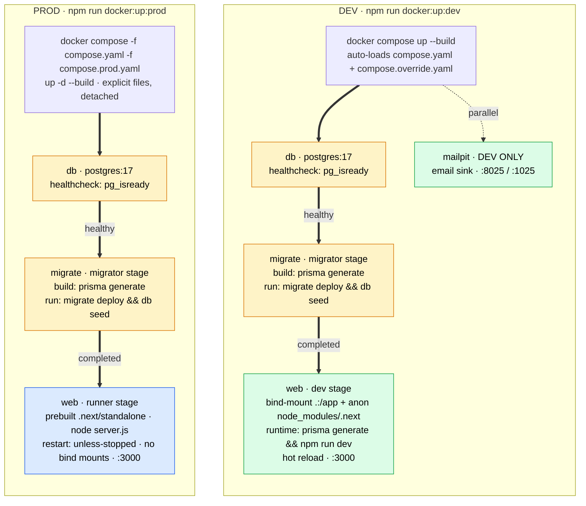

Two environments, one shared spine. The **amber** `db` + `migrate` services come from
the base `compose.yaml` and are **identical** in both — Postgres 17 with a `pg_isready`
healthcheck (`compose.yaml:35-49`), then the one-shot `migrate` service (`migrator`
stage) that runs `prisma migrate deploy && prisma db seed` (`Dockerfile:14-19`). The
ordering is enforced by `depends_on` conditions: `migrate` waits for `db` **healthy**,
and `web` waits for `migrate` **completed_successfully** (`compose.yaml:16-20, 31-33`).

The columns diverge only at **`web`** and which files load. **Dev** (`docker compose up`)
auto-loads `compose.override.yaml`: the `dev` stage bind-mounts source + anonymous
`node_modules`/`.next` volumes, regenerates the Prisma client and runs `npm run dev` for
hot reload (`compose.override.yaml:2-12`), and adds a **dev-only `mailpit`** email sink
(`compose.override.yaml:14-19`). **Prod** (`-f compose.yaml -f compose.prod.yaml up -d`)
runs the prebuilt `runner` image (`node server.js` from `.next/standalone`) with
`restart: unless-stopped`, detached, no bind mounts and no mailpit
(`compose.prod.yaml`). See [where prisma generate runs](./2026-07-15-prisma-generate-dev-vs-prod.md)
for how the client is built in each.
