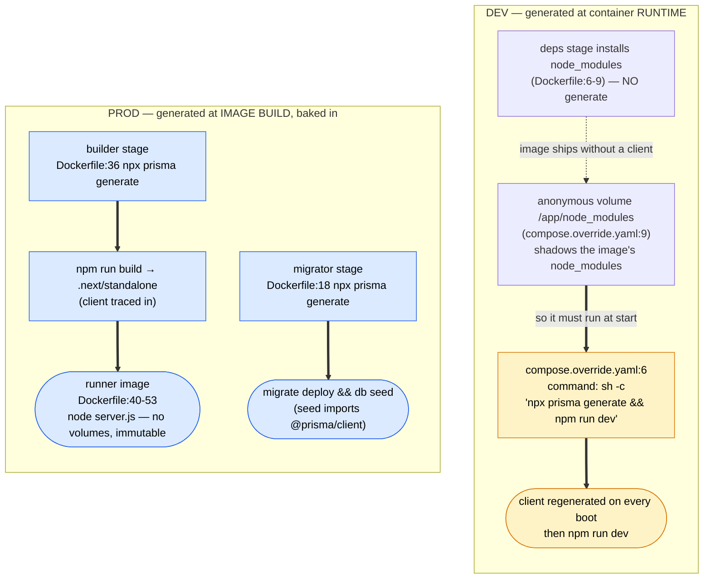

Same command, run at a different time. **Dev** regenerates the Prisma client on every
container start (`compose.override.yaml:6`) because the `deps` stage never generates it
(`Dockerfile:6-9`) and the anonymous `node_modules` volume (`compose.override.yaml:9`)
shadows the image's copy — so there's nothing baked in to reuse. **Prod** generates at
**image build time**: the `builder` stage runs it before `npm run build`
(`Dockerfile:36`) and the client is traced into `.next/standalone`, then copied into the
immutable `runner` image (`Dockerfile:48`) — no volumes, nothing to redo at startup.
There's a third site: the one-shot `migrator` stage also generates
(`Dockerfile:18`), because the DB seed script imports `@prisma/client`.
